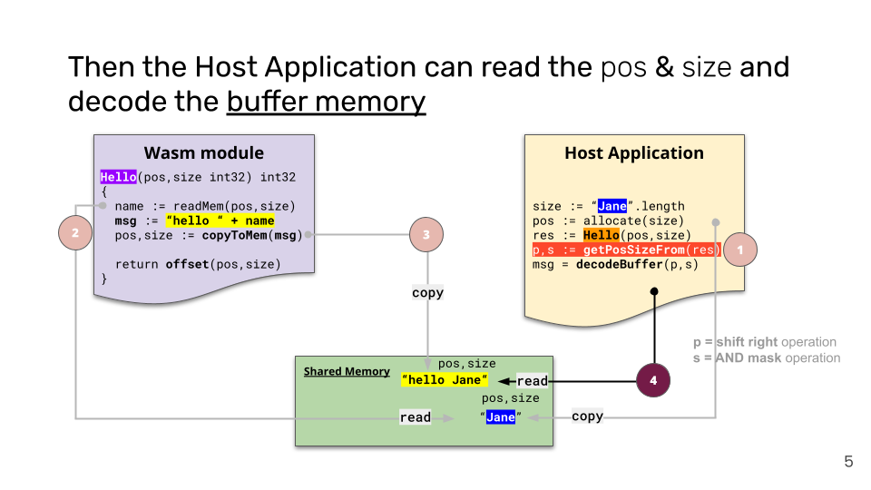
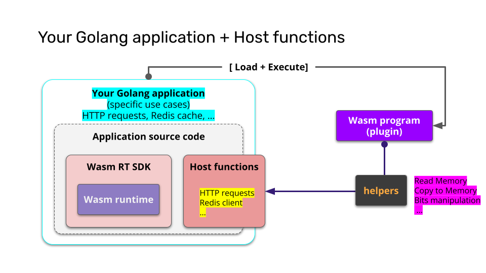
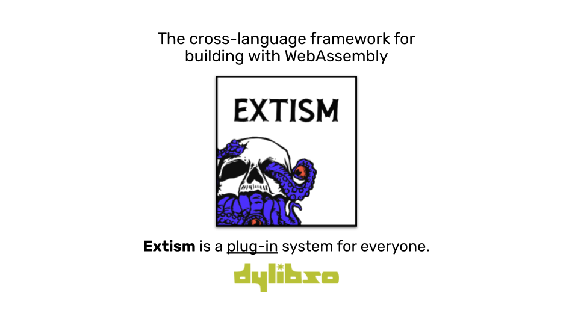
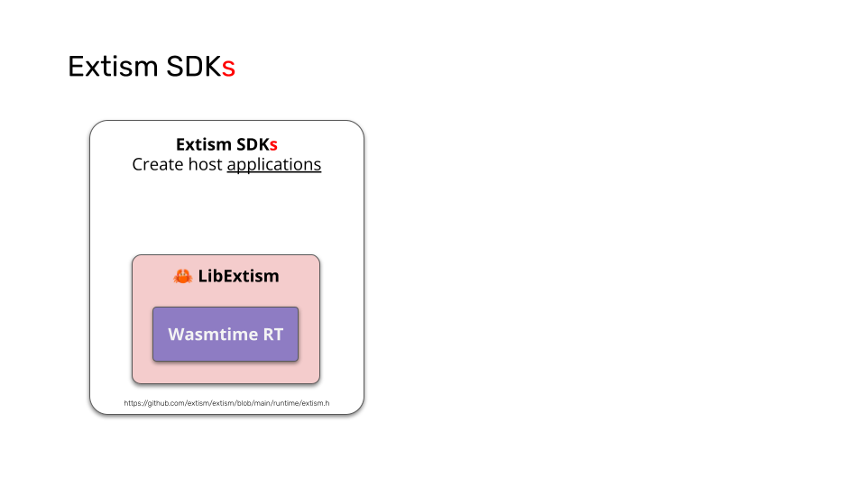
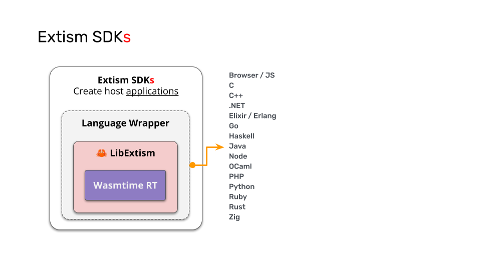
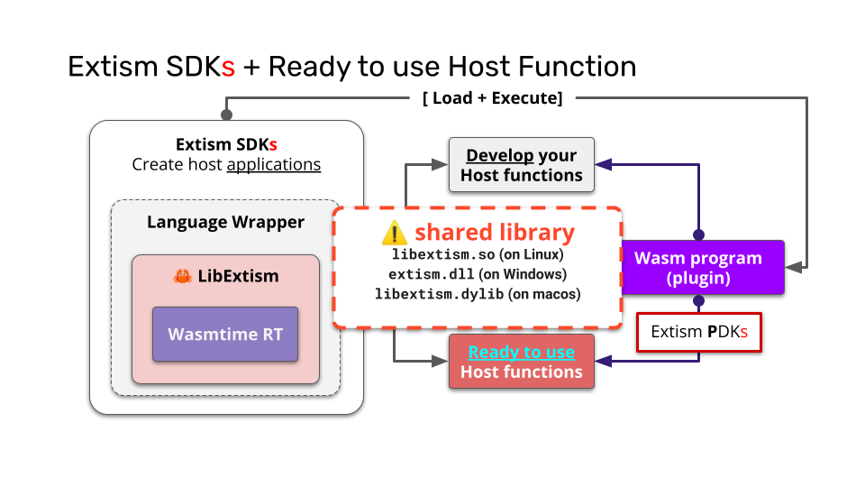
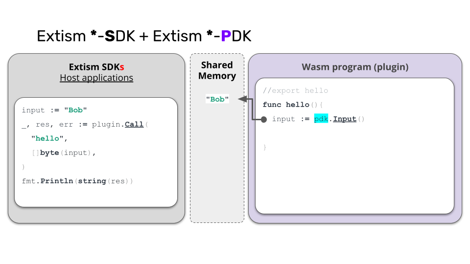
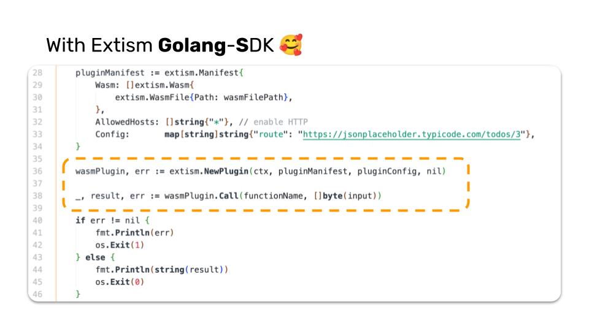

# Créer des plugins en Rust, TinyGo, ... 
## pour vos applications Go avec WebAssembly et Wazero et Extism
### SnowCamp 2024 ⛄️
---
# Philippe Charrière

- Old geek
- Solutions Architect at 🐳 Docker
- Wasm addict 
- @k33g_org on 🐦 X

---
# Agenda

- Talk, chat about Wasm/Wasi
- Some simples exercises

---
# 🍊 Gitpod

This project is gitpodified with [gitpod.io](https://gitpod.io). That means you will run a VSCode environment in the browser. The advantage is that everything is already installed.

=> bandwidth 🥰

---

# Wasm?

- Code > Bytecode (wasm binary file)
- Binary format for executing code on the Web
- The JavaScript VM is responsible for the execution of the WASM code
- WASM is polyglot
- WASM is safe

---

# Why WASM?

- A complement to JavaScript
- Near-native speeds
- Complex applications in web browsers

---

# WebAssembly in the browser is amazing

- https://earth.google.com/
- https://stackblitz.com/edit/node-5xrecy?file=index.js


---

# The primary qualities of WASM

- Speed, 
- Efficiency, 
- Safe, 
- Versatile, 
- Portable

---
# Free WASM from the browser

## Let it Go!

---

# Wasi?

> https://wasi.dev

- Wasi: WebAssembly System Interface
- Interface between 
  - WebAssembly (WASM) code  
  - and a Runtime environment
- Allowing WASM code to be run in various contexts (even the browser) 

---
# Some WASI Use Cases

- CLI applications
- Applications with plug-ins (Zellij, Lapce)
- Database UDF (ScyllaDB, PostgreSQL)
- WebHooks, Filters, … (Webhook Relay, Envoy)
- FaaS (Fermyon cloud, WasmCloud, Shopify, …)
- …
---
# At least, 3 ways to run Wasm programs outside the browser

- WASI Runtimes CLI
- WASI Runtimes SDK
- Ready to use applications with embedded Wasm runtime
  - Spin from Fermyon
  - Wasm Workers Server from Wasm Lab
  - …
---
# WASI Runtimes

- WasmEdge, 
- Wasmtime, 
- Wasmer, 
- Wazero 🩵, 
- NodeJS, 
- … 

---
# 🚀 Exercises

- `01-hello-rust.md`
- `02-hello-go.md`
- `03-files-go.md`
- `04-env-var-go.md`

---
# Wasm/Wasi: some limitations

---
# 🚀 Exercise 05

- `05-call-functions-go.md`

---
# One of the “annoying” limitations

- Only numbers 😮
  - How to pass string arguments to a Wasm function?
  - How to return a string as the result of a Wasm function call?

---
# Solution

## Exchange data with the Shared Memory Buffer

---


---


---


---


---
# 📝 Reading (not today)

- About WASM, WASI and Strings with NodeJS: https://k33g.hashnode.dev/series/wasi-nodejs

---
# Wasi CLI: DIY 🛠️

- You can develop your own CLI
- But, you need to handle the limitations
  - == Develop all the **“plumbing”**

---
# Wazero Runtime & SDK 🩵🩵🩵

**wazero**: the **zero** dependency WebAssembly runtime for **Go** developers

> - https://wazero.io
> - https://github.com/tetratelabs/wazero/tree/main/examples
---
# 🚀 Exercise 06

- Make your own CLI
- Call a function (not always simple)

---
# But, sometimes, you need more

- Make HTTP requests
- Make Redis requests from the Wasm module
- Use MQTT or NATS
- …

---
# Host Function?

- A function defined in the Host application
- For The Wasm program, it’s used as an import function

---


---
# 📝 Reading (not today)

https://k33g.hashnode.dev/series/wazero-first-steps

- Wazero Cookbook - Part One: WASM function & Host application
- Wazero Cookbook - Part Two: Host functions

---
# “Helpers”, but…

- ✋ You need to write your own glue
- For every language you want to support on the Wasm side 😵‍💫

## 🤬 It’s complicated! But…

---
# There is another way (easier) 👀

### Give super powers to your Golang (but not only) applications

---


---


---
# Extism SDKs
https://extism.org/docs/category/integrate-into-your-codebase

---


---


---


---


---
# Helpers and Ready to use host functions

```golang
pdk.Input()
mem := pdk.AllocateString("output")
pdk.OutputMemory(mem)
```

```golang
pdk.Log(pdk.LogInfo,,"")
req := pdk.NewHTTPRequest("GET", url)
pdk.OutputMemory(mem)
...
```

---


---
# Go-SDK: 
## Extism 💖 Wazero
https://github.com/extism/go-sdk

---


---
# How it works?

---


---


---


---
# 🚀 Exercises 07, 08, 09

- Create Extism plug-ins with the Extism PDKs
  - Golang
  - Rust
  - JavaScript
- Use the Extism CLI to call the functions

---
# Create a Host Application
## Write a CLI with the Extism Go-SDK


---



---
# 🚀 Exercise 10

- Make your own CLI with the Extism Go SDK

---
# 🚀 Exercise 11

- Make an HTTP server to serve wasm functions

---
# 📝 Reading (not today)

https://k33g.hashnode.dev/series/extism-discovery

- Extism & WebAssembly Plugins
- Extism, WebAssembly Plugins & Host Functions
- WebAssembly Plugin in JavaScript with Extism
- Run Extism WebAssembly plugins from a Go application
- Writing Wasm MicroServices with Node.js and Extism
- Write a host function with the Extism Host SDK
- Writing Host Functions in Go with Extism
- Create a Webassembly plugin with Extism and Rust
- WASM Microservices with Extism and Fiber
- Extism Go SDK is now written on top of Wazero

---
# 📝 Reading (not today)

## Extism and Java

- Run WASM functions from Vert-x & Kotlin thanks to Extism
  - https://k33g.hashnode.dev/run-wasm-functions-from-vert-x-kotlin-thanks-to-extism

## Chicory
- https://github.com/dylibso/chicory
---
# WASI Preview 2 Launched

- https://blog.sunfishcode.online/wasi-preview2/

Preview 2 includes two worlds:

- wasi-cli, the "command-line interface" world, which roughly corresponds to POSIX. Files, sockets, clocks, random numbers, etc.

- wasi-http, an HTTP proxy world, organized around requests and responses.

>There are more worlds in development, but for now, the important thing is that we do have multiple worlds included. This means wasi-cli world isn't the only world, or even the primary world. It's just one world, among multiple.